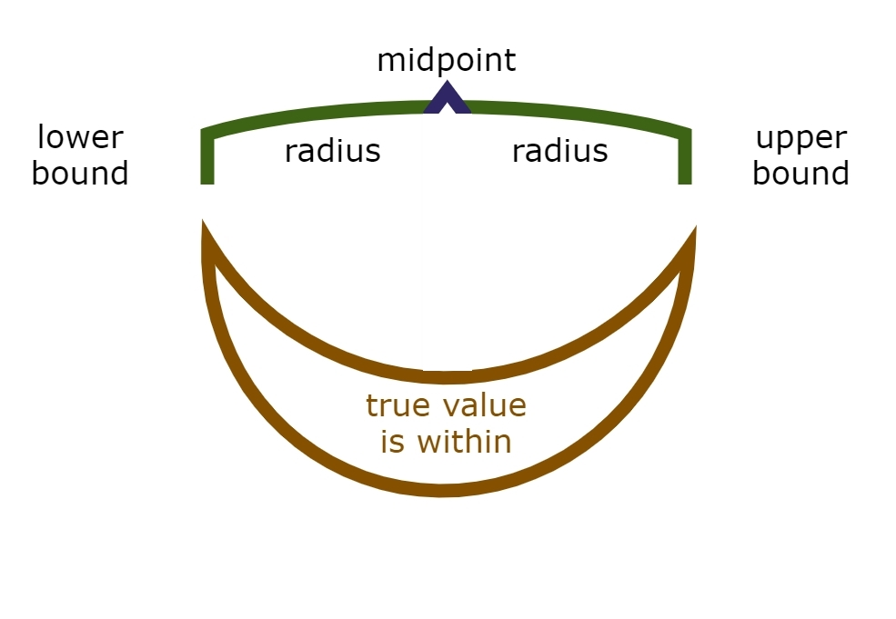

There are three core types: `ArbFloat`, `ArbReal`, `ArbComplex`.  Vectors of elements of these types are formed and used in the usual ways. Some matrix operations are supported through the underlying C library, which requires data be given in row-dominant order, we have Matrix types: `ArbFloatMatrix`, `ArbRealMatrix`, `ArbComplexMatrix`.  Their use is described in the section on Matrices.

----

## ArbFloat

An `ArbFloat` value is an extended precision floating point value where the precision is fixed at construction.

## ArbReal

An `ArbReal` value is implemented in the underlying C library as an `ArbFloat` _midpoint_ and a value enclosing _radius_.

 

## ArbComplex

An `ArbComplex` value is implemented in as two `ArbReal` one for the real part and one for the imaginary part.

You can form an `ArbComplex` using two `ArbReals` or two `ArbFloats` or one of each.

- The real and imaginary parts are recovered using `real(z)` and `imag(z)` where `z` is an `ArbComplex`.

- `angle(z)` and `magnitude(z)` recover the phase angle and the lineal extent of an `ArbComplex` number.

- `conj(z)` obtains the complex conjugate of an `ArbComplex` number.
